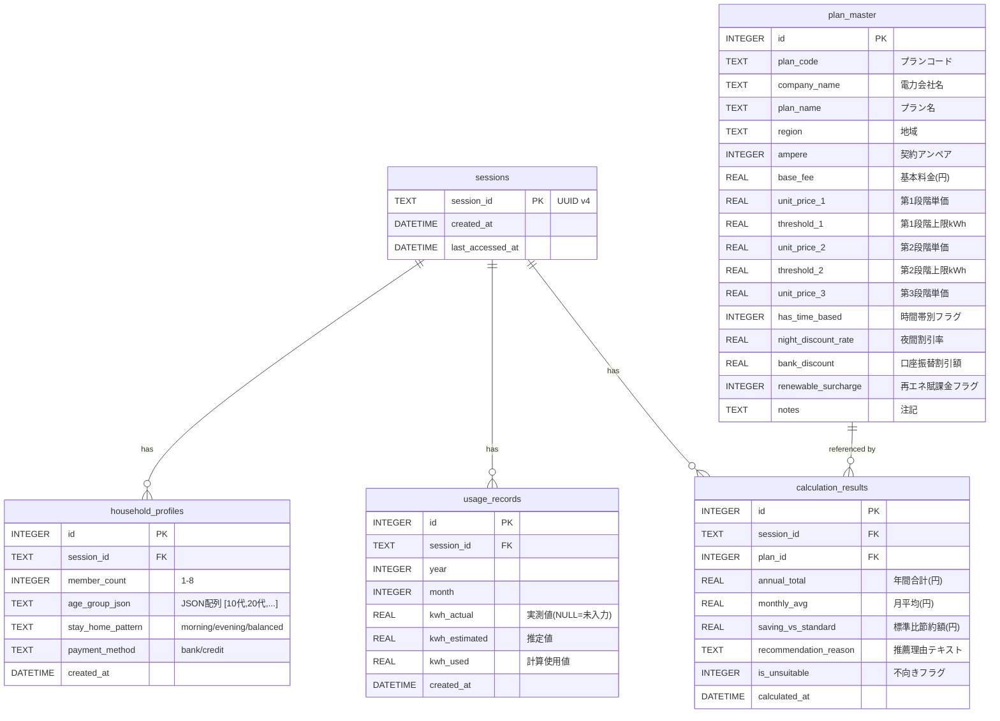
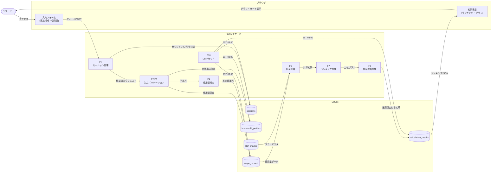
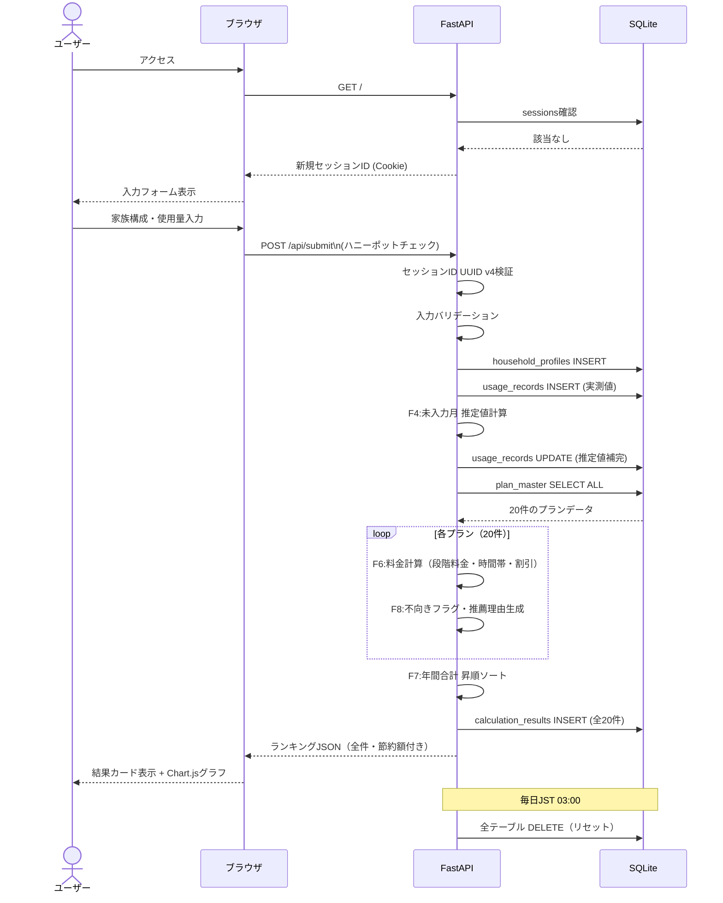
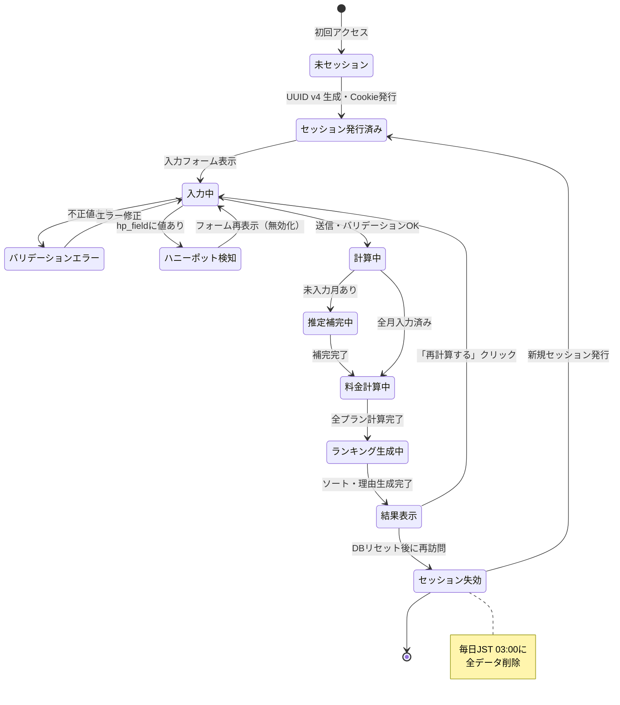
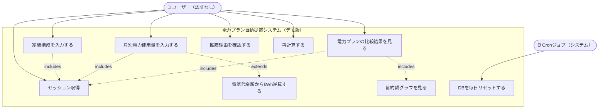

# electricity-plan-advisor-demo
## 電力プラン自動提案システム 設計ドキュメント（デモ版）

> **対象エディション：デモ版**
> **リポジトリ名：** `electricity-plan-advisor-demo`
> **プラットフォーム：** ウェブ（Next.js + Python FastAPI + SQLite）
> **最終更新：** 2025年

---

## 目次

1. [仕様書](#1-仕様書)
2. [ER図](#2-er図)
3. [DFD（データフロー図）](#3-dfdデータフロー図)
4. [シーケンス図](#4-シーケンス図)
5. [クラス図](#5-クラス図)
6. [状態遷移図](#6-状態遷移図)
7. [ユースケース図](#7-ユースケース図)
8. [制約・注意事項](#8-制約注意事項)

---

## 1. 仕様書

### 1.1 概要

家族構成（人数・年齢層・在宅パターン）と月別電力使用量を入力することで、最安の電力プランを自動提案するウェブアプリケーション。

### 1.2 技術スタック

| 区分 | 技術 |
|------|------|
| フロントエンド | Next.js（TypeScript）|
| バックエンド | Python FastAPI |
| DB | SQLite（デモ版固定） |
| 認証 | なし（セッションIDによるデータ分離） |
| デプロイ | Vercel（フロント）／Render（API） |

### 1.3 機能一覧

| 機能ID | 機能名 | 概要 |
|--------|--------|------|
| F1 | セッション管理 | UUID v4発行・Cookie管理・他セッション遮断 |
| F2 | 家族構成入力 | 世帯人数・年齢層・在宅パターン・支払方法収集 |
| F3 | 使用量入力 | 12ヶ月分kWh入力・円逆算・バリデーション |
| F4 | 使用量プロファイル推定 | 未入力月の推定・季節補正 |
| F5 | プランマスタ参照 | SQLiteマスタから全プラン取得 |
| F6 | 電気代計算 | 段階料金・時間帯別料金・割引の積算 |
| F7 | プランランキング生成 | 全プラン年間電気代順ソート・節約額計算 |
| F8 | 提案理由生成（ルールベース） | キーワードマッチによる推薦理由テキスト生成 |
| F9 | 結果保存・表示 | セッションひもづき保存・カード表示・Chart.js可視化 |
| F10 | DBリセット | JST 03:00 毎日全セッションデータ削除 |

### 1.4 マスタデータ件数（デモ版）

| マスタ名 | 件数 | 説明 |
|----------|------|------|
| 電力プランマスタ | **20件** | 主要電力会社・新電力の代表的プラン（地域：東京エリア想定） |
| 世帯プロファイルマスタ | **18件** | 世帯人数（1〜8）×在宅パターン（昼間主/夜間主/均等）の組み合わせ（3パターン×6人数区分） |
| 年齢層係数マスタ | **6件** | 10代／20代／30代／40代／50代／60代以上 の使用量係数 |
| 季節補正係数マスタ | **12件** | 月別（1〜12月）の補正係数 |
| **合計** | **56件** | |

> ⚠️ **デモ版の制約：** デモ版では上記の最小単位データ（56件）でしかテストできません。
> 製品版フルエディションでは全国の電力会社・プランを網羅したマスタデータを使用します。

### 1.5 画面一覧

| 画面名 | パス | 概要 |
|--------|------|------|
| トップ／入力画面 | `/` | 家族構成・使用量入力フォーム |
| 結果画面 | `/result` | プランランキング・節約額グラフ |
| （管理）DBリセット確認 | `/admin/reset` | 手動リセット用（内部のみ） |

### 1.6 個人情報の取り扱い

デモ版は個人情報保護法に準拠し、以下の方針で設計する。

| 禁止データ | 代替手段 |
|-----------|---------|
| 生年月日 | 年齢層ラジオボタン（10代〜60代以上） |
| 氏名 | 使用しない |
| メールアドレス | 使用しない |
| 住所・電話番号 | 使用しない |

- セッションIDは端末識別子として扱い、個人情報には該当しない
- 身長・体重等は使用しない

### 1.7 セキュリティ方針

- **ハニーポット**：非表示フォームフィールド `hp_field` に値がある場合はリクエストを無視
- **外部API使用禁止**：APIキーが必要なサービスは一切使用しない
- **セッション分離**：全テーブルに `session_id` カラムを設け、他セッションのデータ参照・操作を禁止
- **セッションID検証**：受信時にUUID v4フォーマット（正規表現）を検証し、不正な場合は新規発行

---

## 2. ER図

---

## 3. DFD（データフロー図）

---

## 4. シーケンス図

---

## 5. クラス図

```mermaid
classDiagram
    class SessionManager {
        +session_id: str
        +validate_uuid(cookie: str) bool
        +issue_new_session() str
        +get_or_create(cookie: str) str
    }

    class HouseholdProfile {
        +session_id: str
        +member_count: int
        +age_groups: list[str]
        +stay_home_pattern: str
        +payment_method: str
        +validate() bool
    }

    class UsageRecord {
        +session_id: str
        +year: int
        +month: int
        +kwh_actual: float|None
        +kwh_estimated: float
        +kwh_used: float
        +get_effective_kwh() float
    }

    class UsageEstimator {
        +base_kwh_per_person: dict
        +season_coefficients: dict
        +estimate_month(profile: HouseholdProfile, month: int) float
        +fill_missing(records: list[UsageRecord]) list[UsageRecord]
    }

    class PlanMaster {
        +plan_code: str
        +company_name: str
        +plan_name: str
        +base_fee: float
        +tiers: list[Tier]
        +has_time_based: bool
        +night_discount_rate: float
        +bank_discount: float
    }

    class Tier {
        +unit_price: float
        +threshold_kwh: float|None
    }

    class ElectricityCalculator {
        +calculate(plan: PlanMaster, usage: list[UsageRecord], profile: HouseholdProfile) CalculationResult
        +calc_tiered(kwh: float, tiers: list[Tier]) float
        +apply_time_based(kwh: float, pattern: str, discount: float) float
        +apply_discounts(total: float, plan: PlanMaster, profile: HouseholdProfile) float
    }

    class CalculationResult {
        +plan: PlanMaster
        +annual_total: float
        +monthly_avg: float
        +saving_vs_standard: float
        +is_unsuitable: bool
        +recommendation_reason: str
    }

    class RankingGenerator {
        +results: list[CalculationResult]
        +standard_annual: float
        +generate() list[CalculationResult]
        +sort_by_annual() list[CalculationResult]
    }

    class ReasonGenerator {
        +REASON_RULES: dict
        +generate(plan: PlanMaster, profile: HouseholdProfile, result: CalculationResult) str
        +check_unsuitable(plan: PlanMaster, profile: HouseholdProfile) bool
    }

    class DBResetJob {
        +reset_time_jst: str
        +run() None
        +delete_all_sessions() None
    }

    HouseholdProfile --> SessionManager : uses
    UsageRecord --> SessionManager : uses
    UsageEstimator --> HouseholdProfile : uses
    UsageEstimator --> UsageRecord : fills
    ElectricityCalculator --> PlanMaster : reads
    ElectricityCalculator --> UsageRecord : reads
    ElectricityCalculator --> HouseholdProfile : reads
    ElectricityCalculator --> CalculationResult : creates
    PlanMaster "1" --> "1..*" Tier : contains
    RankingGenerator --> CalculationResult : sorts
    ReasonGenerator --> CalculationResult : annotates
    ReasonGenerator --> PlanMaster : reads
    ReasonGenerator --> HouseholdProfile : reads
```

---

## 6. 状態遷移図

---

## 7. ユースケース図

---

## 8. 制約・注意事項

### 8.1 デモ版の制約（再掲）

| 制約項目 | 内容 |
|---------|------|
| 外部API | 一切使用禁止（APIキー不要なPythonライブラリは使用可） |
| 認証 | なし（セッションIDによるデータ分離のみ） |
| DB | SQLite固定（毎日JST 03:00 全データリセット） |
| マスタデータ | **56件（最小単位）でしかテストできない** |
| ワンショット実装 | `claude --dangerously-skip-permissions` で1issueで実装する |
| 個人情報 | 生年月日・氏名・メール・住所・電話番号は使用禁止 |

### 8.2 マスタデータ件数の制約について

> **重要：** デモ版のマスタデータは東京エリアの代表的な20プランのみです。
> 全国の電力プランは800件以上存在しますが、デモ版では最小単位の20件でしか動作確認・テストができません。
> 製品版フルエディションへの移行時は、マスタデータの拡充（全国対応・全プラン網羅）が必須です。

### 8.3 AI機能の代替

デモ版はウェブ版のため、AI機能は以下のルールベースで代替します。

| AI機能 | デモ版の代替手段 |
|--------|----------------|
| AI分類 | キーワードマッチによるルールベース分類 |
| AI要約・推薦理由 | テンプレートベースの文言生成（F8） |
| 需要予測 | 統計的な係数テーブルによる補完（F4） |

### 8.4 将来の拡張（MVP以降）

- Google認証によるマルチユーザー対応
- PostgreSQLへのDB移行
- LangGraphを使ったAI推薦エンジン
- 全国電力プランマスタの整備（800件以上）
- スマートメーターAPIとの連携

---

*このドキュメントはデモ版の設計仕様です。製品版フルエディションでは別途プライバシーポリシー・個人情報管理規程に従い再設計します。*
